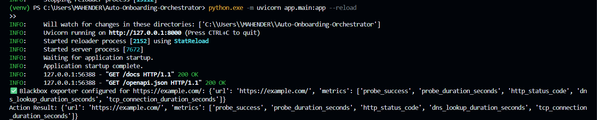

# 🚀 Auto-Onboarding-Orchestrator

<div align="center">

 <!-- Image detected in repository -->

[](https://github.com/VennelaSara/Auto-Onboarding-Orchestrator/stargazers)

[](https://github.com/VennelaSara/Auto-Onboarding-Orchestrator/network)

[](https://github.com/VennelaSara/Auto-Onboarding-Orchestrator/issues)

[](LICENSE) <!-- TODO: Add actual license file and link -->

**Streamline and automate your onboarding workflows with intelligent orchestration.**

</div>

## 📖 Overview

The `Auto-Onboarding-Orchestrator` is a backend service designed to automate and manage complex onboarding processes. It acts as a central hub, orchestrating various tasks, integrations, and approvals required when a new entity (e.g., employee, user, system resource) is brought into an organization or system. By defining workflows, this orchestrator aims to reduce manual effort, minimize errors, and accelerate the onboarding lifecycle.

## ✨ Features

-   🎯 **Automated Workflow Execution**: Define and run multi-step onboarding workflows automatically.
-   📋 **Dynamic Task Management**: Assign and track individual tasks within an onboarding process.
-   🔗 **System Integrations**: Facilitate connections with external systems (e.g., HR, IT, provisioning tools).
-   📊 **Onboarding Status Tracking**: Monitor the progress of each onboarding journey in real-time.
-   🔔 **Configurable Notifications**: Send alerts and updates based on workflow events.
-   ⚙️ **Extensible Workflow Definitions**: Easily define and adapt new onboarding flows.

## 🖥️ Screenshots

A visual representation of an example onboarding workflow or system architecture:


## 🛠️ Tech Stack

**Backend:**


<!-- TODO: Add specific Python framework badge if detected (e.g., FastAPI, Flask, Django) -->

**Database:**
<!-- TODO: Add specific database badge if detected (e.g., PostgreSQL, MongoDB, SQLite) -->

**DevOps:**
<!-- TODO: Add deployment tools if detected (e.g., Docker, Kubernetes, CI/CD pipelines) -->

## 🚀 Quick Start

Follow these steps to set up and run the Auto-Onboarding-Orchestrator locally for development.

### Prerequisites
-   **Python 3.x**: Ensure you have Python 3.8 or higher installed.
    ```bash
    python --version
    ```
-   **Virtual Environment Tool**: `venv` (usually comes with Python) or `conda`.
-   <!-- TODO: Add specific database client or other system dependencies if applicable -->

### Installation

1.  **Clone the repository**
    ```bash
    git clone https://github.com/VennelaSara/Auto-Onboarding-Orchestrator.git
    cd Auto-Onboarding-Orchestrator
    ```

2.  **Set up a virtual environment**
    ```bash
    python -m venv venv
    source venv/bin/activate # On Windows use `venv\Scripts\activate`
    ```

3.  **Install dependencies**
    Navigate into the `app` directory and install the required Python packages.
    ```bash
    cd app
    # If a requirements.txt exists:
    pip install -r requirements.txt
    # Else, install necessary packages manually or create a requirements.txt
    # Example: pip install Flask # or FastAPI, SQLAlchemy, etc.
    cd .. # Go back to project root
    ```
    <!-- TODO: If requirements.txt is at the root, adjust path. If not present, indicate to create one or install manually. -->

4.  **Environment setup**
    Create a `.env` file in the `app` directory for environment-specific configurations.
    ```bash
    # Example .env content (adjust based on actual app needs):
    # DATABASE_URL=sqlite:///./sql_app.db
    # SECRET_KEY=your_super_secret_key
    # LOG_LEVEL=INFO
    ```
    <!-- TODO: Create a `.env.example` in the app directory for better guidance. -->

5.  **Database setup** (if applicable)
    If the application uses a database, you might need to run migration scripts or initialize the database.
    ```bash
    # Example (e.g., for SQLAlchemy/Alembic, or Django migrations):
    # python -m app.database.migrations upgrade head
    # python -m app.manage.py migrate
    ```
    <!-- TODO: Provide actual database setup commands based on detected ORM/DB. -->

6.  **Start development server**
    Navigate into the `app` directory and run the main application file.
    ```bash
    cd app
    python main.py # Or specific framework command, e.g., 'flask run' or 'uvicorn main:app --reload'
    ```
    <!-- TODO: Replace with actual entry point and framework-specific run command. -->

7.  **Open your browser**
    Visit `http://localhost:[detected port]` (e.g., `http://localhost:8000`).
    <!-- TODO: Update with actual port from code. -->

## 📁 Project Structure

```
Auto-Onboarding-Orchestrator/
├── .gitignore             # Standard git ignore file for Python projects
├── app/                   # Main application directory containing all Python source code
│   ├── ...                # Subdirectories for modules, logic, configurations, etc.
│   └── main.py            # Likely the primary entry point of the application
├── output_1_project_1.png # Workflow diagram or screenshot
└── desktop.ini            # System generated file (can be ignored)
```

## ⚙️ Configuration

### Environment Variables
The application relies on environment variables for sensitive data and configurable settings. It's recommended to define these in an `.env` file in the `app` directory.

| Variable       | Description                                 | Default   | Required |

|----------------|---------------------------------------------|-----------|----------|

| `DATABASE_URL` | Connection string for the database          | `None`    | Yes      |

| `SECRET_KEY`   | Secret key for cryptographic operations     | `None`    | Yes      |

| `LOG_LEVEL`    | Logging verbosity (e.g., INFO, DEBUG, WARN) | `INFO`    | No       |

| <!-- TODO -->  | <!-- Add more detected variables -->         | <!-- -->  | <!-- --> |

### Configuration Files
<!-- TODO: List any specific configuration files (e.g., `config.py`, `settings.yaml`) and their purposes if detected within the `app` directory. -->

## 🔧 Development

### Available Scripts
<!-- TODO: Based on `package.json` scripts (if JS/TS) or custom Python scripts (e.g., `run.sh`, `Makefile`) -->

| Command | Description |

|---------|-------------|

| `python app/main.py` | Starts the development server |

| <!-- TODO --> | <!-- Add more scripts like test, lint, build --> |

### Development Workflow
Contributions and development should ideally follow standard Python best practices, including virtual environments, clear dependency management (`requirements.txt`), and adherence to code style guides.

## 🧪 Testing

<!-- TODO: Based on detected testing framework (e.g., `pytest`, `unittest`). Provide commands to run tests. -->
```bash

# Example: Run all tests

# python -m pytest app/tests/

# Example: Run specific test file

# python -m pytest app/tests/test_workflow.py
```

## 🚀 Deployment

### Production Build
Python applications typically don't have a "build" step like compiled languages or frontend frameworks. Deployment usually involves packaging the code, dependencies, and configuration.

### Deployment Options
<!-- TODO: Based on detected deployment configs (e.g., Dockerfile, Kubernetes manifests, cloud deployment scripts). -->
-   **Docker**: If a `Dockerfile` is added, containerization would be the recommended deployment method.
-   **Cloud Platforms**: Deploy to platforms like AWS ECS/Lambda, Google Cloud Run/App Engine, Azure App Service, or Heroku, often requiring specific configuration files.

## 📚 API Reference (if backend endpoints are exposed)

This orchestrator is expected to expose an API for defining and interacting with onboarding workflows.
<!-- TODO: Generate actual API reference based on detected routes/endpoints within the `app` directory (e.g., Flask/FastAPI routes). -->

### Endpoints
<!--
Example:
#### `POST /api/onboarding/start`
Starts a new onboarding workflow.

**Request Body:**
```json
{
  "workflow_id": "string",
  "entity_id": "string",
  "data": {}
}
```

**Responses:**
- `202 Accepted`: Workflow initiated.
- `400 Bad Request`: Invalid input.
-->

## 🤝 Contributing

We welcome contributions to enhance the `Auto-Onboarding-Orchestrator`! Please consider the following guidelines:

-   Fork the repository and create your feature branch (`git checkout -b feature/AmazingFeature`).
-   Commit your changes (`git commit -m 'Add some AmazingFeature'`).
-   Push to the branch (`git push origin feature/AmazingFeature`).
-   Open a Pull Request.

### Development Setup for Contributors
Ensure your development environment is set up as described in the [Quick Start](#quick-start) section. Before submitting a pull request, please ensure all tests pass and your code adheres to the project's coding standards.

## 📄 License

This project is licensed under the <!-- TODO: Add actual LICENSE_NAME from LICENSE file -->. See the [LICENSE](LICENSE) file for details.

## 🙏 Acknowledgments

-   VennelaSara for initiating this project.
-   <!-- TODO: List major libraries/frameworks used within `app` if detected, e.g., Flask, SQLAlchemy, FastAPI. -->

## 📞 Support & Contact

-   📧 Email: <!-- TODO: Add contact email -->
-   🐛 Issues: [GitHub Issues](https://github.com/VennelaSara/Auto-Onboarding-Orchestrator/issues)
-   👤 Author: [VennelaSara](https://github.com/VennelaSara)

---

<div align="center">

**⭐ Star this repo if you find it helpful!**

</div>

